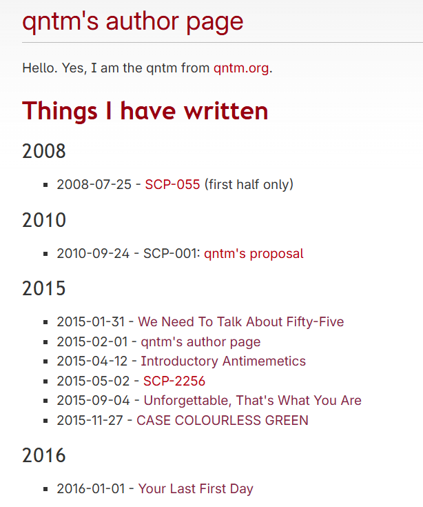
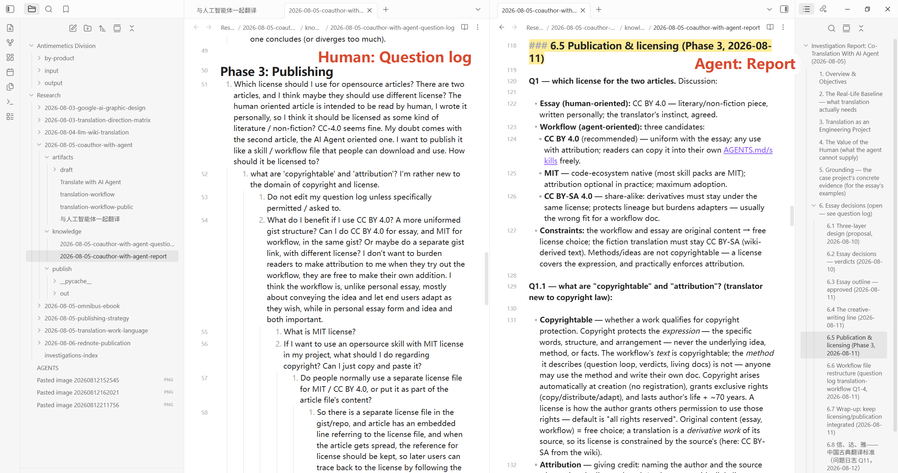
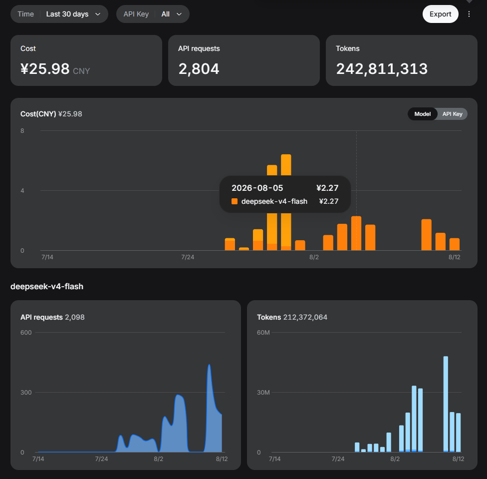

# 与人工智能体一起翻译

最近我与人工智能体一起翻译了一篇小说——由作家[qntm](https://qntm.org/)用英文写作的《这里没有逆模因部》（*There Is No Antimemetic Division*）。这个系列由多部短篇构成，我将最喜欢的一篇翻译成了中文（我的母语），并且将翻译工作流总结后发布到了[Github](https://github.com/Gojob2987/translate-with-ai-agent/blob/main/translation-workflow-public.md)。原文约3500个英文单词，翻译成中文后接近6000字，用时约两周。折腾下来，我相对有把握的是自己做到了“信”，“达”尽力而为了，“雅”是真说不上。我愈发肯定的是，原文确实是一部科幻杰作，能够在跨越数年的每一次重读中都吸引我。即使我花了很长时间打磨译文，经受了一些折磨，最后还是觉得这个故事很好，特别是在AI大行其道的今天（故事的许多点子和构思可以在当今的AI理论中找到关联）。原文一开始在网上连载，近两年正式出版实体书了，可喜可贺。根据作者的官网，简中版目前由新经典（ThinKingDom）筹备出版中，发行时间待定。

*原文自2015年起在[社区](https://scp-wiki-cn.wikidot.com/qntm-s-author-page)连载*

我是一名软件工程师，从小对读小说感兴趣。这些年书读了一些，但写的很少。近期工作没那么忙，腾出一些时间探索学习，所以我（又一次）尝试入坑AI，打算把当下流行的人工智能体（AI Agent）融入工作流。前面几次尝试的效果都不太好，主要是因为我缺少一个目标，一个兴趣爱好，导致我把智能体部署好后就不知道干什么了。

探索途中，我发现了这篇帖子 [Karpathy LLM Wiki](https://gist.github.com/karpathy/442a6bf555914893e9891c11519de94f)，讲的是如何使用人工智能体维护一个个人知识库。我觉得很有意思。所谓“工欲善其事，必先利其器”，或者说文学课一上来就教[《如何阅读一本书》](https://en.wikipedia.org/wiki/How_to_Read_a_Book)（*How to Read a Book*）。在进一步学习前，先准备好一个笔记本是非常自然的想法。我打算用这篇帖子提到的概念去维护个人知识，去学习并记录一些我真正感兴趣的东西。于是我（又一次）对自己提问：我要做什么？我到底对什么感兴趣？

然后我听说《这里没有逆模因部》的实体书正式出版了——其实我在2025年年初就知道它要出版了，本来打算第一时间购入的，但是工作太忙了。一直到2026年7月份的时候才想起来这回事，于是激情下单。我第一次读到这个系列的时候还在念书，差不多是10年前。这是一系列关于怪异“想法”的故事——无法被描述的想法，无法被记住的想法，一想到“它”就会被“它”杀死的想法。这不是画面或者音效层面的恐怖。对于平时就想得比较多的我来说，这玩意是实打实存在的东西。

关于人工智能体和个人知识库的探索，让我想起逆模因部的故事。在等书期间，我把连载版又读了一次，给我的冲击感和10年前第一次读差不多，而且这次我看到了AI与这个故事的关联点，在此列举一些。事先声明，我不是专门搞AI的，所以我对一些专有概念可能理解有误，欢迎指正。接下来我可能会把“人工智能体（AI Agent）”和“大语言模型（Large Language Model, LLM）”混为一谈。
- 故事中，存在一个具有信息消除能力的怪物。它能将受害者相关的信息隔绝于世，从存在层面隔离受害者，最终吃掉受害者所有的知识与记忆。这种消除甚至能影响历史，就像受害者从来不曾存在过。这个能力和我用到的文本阅读软件“黑曜石”（[Obsidian](https://obsidian.md/)）其中一个功能很像。这个功能叫“断链”，即解除一篇文章与其它所有文章的关联。被断链的文章成为一个孤立的个体，在做格式检查时会被作为异常识别出来。
- 故事中，干员们会主动清除自己的记忆，以避免记忆被有害思想侵蚀。这就像用人工智能体作业时的“新建会话”（/new session）功能，用于避免智能体被过多的信息干扰注意力。毕竟，人工智能体作业的一个基本原则就是“在一个会话中，专注干一件事情”。
- 故事中，干员们接受的一项训练是“基于观察，推导并还原出自己的记忆、知识与人格”，用于应对自己的记忆被消除的情况。这就像让人工智能体在新的对话中推导还原出项目进度，继续工作。我一般会在一个已经很长的对话中，告诉智能体“我要切新对话了，提交并推送修改，给未来的你交接工作，我们下个对话见”。
- 故事中，干员们采取一种非线性的研究策略，以探索有效控制异常实体的方法。每个人探索不同的方向，最后把信息汇总到同一篇文档/同一个会议室里。这和我的学习方法很像。人工智能体提供的信息又多又快，每一轮对话包含大量的信息。如果把对话限制成一次只交流一个问题，效率就太低了。所以我会用两个文件分别记录我的问题和智能体的回答。我会先写一个问题，让智能体出一篇报告，然后我读报告并更新多个问题，让智能体批量答复并更新到报告中，如此循环。这和看书的批注也有类似之处：看书时，产生很多问题，一个一个去搜很打断思路，批量去搜效率高不少。从一个问题出发，会产生许许多多的问题与调查方向，呈树状展开。
- ……

*树状展开的问题记录*

总之，我发现几件事：
- 我真的很喜欢这部小说！
- 这部小说在AI盛行的当下具有重要意义，在当下读起来别有一番风味。
- 我想把这部小说翻译成我的母语，让更多人读到它。
- 这个翻译工程就是我在寻找的那个项目，可以让我把对AI的学习与自己的兴趣爱好结合起来。我会试着在翻译过程中使用人工智能体，边做边学，看看这里都有什么门道。

回头看，除了翻译本身，我还做了不少事情：
- 我提出了不少问题，比如“应该用什么工具绘图/发布小红书卡片”，“应该怎么出版，有哪些版权事情需要注意”。我觉得这些问题都很有意思，并且经过一顿（非线性的）摸索后，各自形成了独立的调查报告。
- 我提取了自己的“翻译工作流”，发布在[Github](https://github.com/Gojob2987/translate-with-ai-agent/blob/main/translation-workflow-public.md)
- 翻译过程加深了我对原文的理解，许多精妙之处在我尝试翻译后才显现。得益于与人工智能体的讨论，以及智能体快速将我的想法记录为文档的能力，我在翻译过程中一定程度上保持了身心健康。要是我一个人搞，脑子可能已经爆炸了，因为想法实在太多，光是写下来就很累了（就像手写这篇文章）。

闲话到此为止。关于与人工智能体一起翻译，下面我将尝试总结一些经验。

# 事先声明

- 本文讨论笔译；口译**不在**本文讨论范围之内。
- 本文讨论以人主导，以人工智能体辅导的翻译方法；完全由人工智能体自主进行的翻译（fully autonomous AI translation）**不在**本文讨论范围之内。
- 以及，我本人**并非**文学、翻译、哲学、历史、AI研究专业出身，顶多算是个还在摸索的爱好者，背景知识相对有限，各种描述一定会有不准确的地方。
- **欢迎讨论！**

# 翻译（笔译）需要什么

我认为翻译本质上是深度的阅读、思考和写作。译者阅读原文，理解原文，然后将原文的信息以另一种方式表述出来。表述不局限于语言，也可以是某种社会习俗/说话方式（“师爷，给翻译翻译。”）

抛开爆炸的科技与酷炫的AI广告，回到起点，想象一下翻译是如何进行的。以下是几点可以帮助你翻译的东西：
- **一个安静的房间**：一个吵闹的房间，跑来跑去的孩子，没洗的碗筷和脏衣服。待在这里很难让人静下心来阅读或写作，更不用说思考。或者想象你坐在工位上，消息框闪个不停，好几个事情并行在搞，领导还在给你加活。总之，一个安静的房间是很有必要的。吸尘器和洗衣机着实是两件伟大的发明。
- **一位可以讨论的同伴**：与自由写作不同，译者需要基于原文进行翻译。翻译内容要忠于原文，这点至关重要。原文一般是用“自然语言”写作的（或者说以人类为接收对象的语言）。不同于数学公式、编程语言等，“自然语言”或者“给人理解的语言”天然具有模糊性，所以读者本质上是在猜作者的意思。译者首先是读者，所以译者也是在猜原文作者的意思。既然是在和猜想打交道，并且力求“猜对”，那么就需要借助核对、交叉检验、第三方意见等手段进行。一个人猜来猜去没什么意思，猜到最后很容易把自己绕进去，得有同伴一起讨论，比如朋友、网友、同事或者编辑。
- **字典**：阅读过程中经常遇到不理解或者不会读的字词，以及典故。就算是在读中文（我的母语）小说，我也经常要查字典，查读音或者成语意思。翻译要忠于原文，理解原文是翻译的基础，至少要把每一个生词的含义弄懂。
- **纸笔**：阅读和思考需要涂涂写写。那么多的批注、生词和奇思妙想需要被写下来。纸和笔最好量大管饱，写他个昏天暗地。翻译说到底是一种猜想，而猜想过程本身就充满了提问与试错，比如“原文这里是什么意思呢？”，“换一个表达方式会不会更好呢？”。想法来得快，去得也快，抓紧把它们写下来。

# 人工智能体提供了写作环境

代入上文的框架，现在来看看人工智能体能给我们带来什么：
- **一个安静的房间**：碳基生物需要吃喝拉撒，所以你还是要找一个现实意义中安静的房间。不过人工智能体可以提供两点帮助：
	- 人工智能体很擅长干“脏活”，比如语法检查、格式校对、材料归档。这些工作会占用大量时间，打扰你进行更有创造性的活动。关于“让人工智能体帮我打杂”这个想法，可以进一步参考Karpathy对个人知识库的论述 [Karpathy LLM Wiki](https://gist.github.com/karpathy/442a6bf555914893e9891c11519de94f)
	- 人工智能体能以极快的速度提供大量信息，快速给你构造一个“信息茧房”，让你没有时间去关注与当前项目无关的事情，从而提升工作效率。引用逆模因部的说法，这是一种“反向隔离”：一般来说，异常实体被关在笼子里，笼子外是正常世界；反向隔离是指正常人住在笼子里，而异常实体在外面到处都是——当你的信息处理管道被当前工作占满，从而没有精力关注无关的事情时，你就是把自己关在了一个“安静的房间”里。当然，在人工智能体给你提供的信息中，有不少是发散性质的，并不会给推进项目带来直观的好处，某种程度上会让你分心。这种情况下，我会让人工智能体把某个值得深究，但是过于发散/相对离题的方向总结成一篇独立的调查文档，供后续进一步探索。人工智能体提供了高速处理信息的能力，就看你怎么用。
- **一位可以讨论的同伴**：AI作为聊天机器人为世人所知，你当然可以把人工智能体当成一个威力加强版的聊天机器人。除了聊天，智能体还可以帮你记录并整理各种读书笔记、调查记录、对话历史以及参考材料。智能体能直接读这些材料，从中学习故事背景、你的作业习惯、你的措辞、你对故事的理解，以及你对它的预期。这是一个一起讨论，共同进步的过程。
- **字典**：人工智能体是一个非常方便的字典，可以按照你要求的格式返回内容。我一般会让它在每次调查/翻译过程中都维护一个生词表，里面包含字词的含义、读音（英文单词用国际音标IPA，中文用拼音）、外语直译、出现位置等。如果你对某个词真的很感兴趣，直接继续问AI。
- **纸笔**：我使用的工具软件有
	- Obsidian：用于阅读、编辑文本。免费。
	- DeepSeek：大语言模型，相当于人工智能体的大脑。收费，但是很便宜。
	- OpenCode：人工智能体的动力装甲软件（可以理解为人工智能体软件在没有接入大语言模型时是一副空壳、一副躯体、一副机甲；大语言模型是机甲脑袋里的仓鼠）。开源，免费。
	- Git：版本管理，用来在线保存我的文件。免费。
	这些工具都是可以自行选择的，目的只是为了优化我的翻译体验。就和去文具店买本子和笔一样，从自己买得起的里面挑喜欢的就好。
	这里额外提及两点：
	- 费用：我从2026/7/31 开始用DeepSeek V4 Flash，一天八小时全力翻译，花费也就两元（人民币）左右。
	- 模型选择：我个人觉得（没有实测过）翻译时选用的模型，应该根据翻译所涉及的语言进行选择，尽量选择更熟悉相关语言的模型。本次我是将英文翻译成中文，而国内的模型按理说会使用更多本国语言（中文）作为训练语料，相当于对中文更加了解，所以是个好选择。再加上我之前看到过一些网友推荐过用DeepSeek写同人文，所以我这次选择用DeepSeek开展工作。网上某处应该有评估各模型对各类自然语言熟悉程度的榜单，可以参考。

*2026/7/31 DeepSeek V4 Flash正式版发布，我用起来效果不错*

# 用软件工程的方法翻译

我主职是一名软件工程师。我从项目初期就意识到翻译是一项需要持续打磨的工作，和写代码同理。

翻译工作可以从软件工程领域借用一些方法，好处多多：
- **从小做起，持续改进**：笔译就是和文字打交道。你不需要各种营销号上鼓吹的AI神奇功能，不需要引入各种奇怪的软件包。一切都可以用文字表述。把原文搞到手，写一些批注，和人工智能体讨论接下来怎么搞，后面就是不断地讨论、摸索、记录、试错、总结和优化。一开始我并没有方法论和最终的分层目录设计，那些都是在实践中经过多次修改，最后才确定下来的。从这一点来看，翻译项目作为人工智能体新手入坑项目真的很合适，尤其是对于文科生而言。
- **持久化存储**：翻译工程内一切都是文字。所有的想法、背景、问题和进度都可以以文字记录。正所谓“好记性不如烂笔头”，把脑子里的想法写下来有助于清空大脑，让脑子不用反刍同样的东西，腾出精力去思考新的东西。人工智能体和人脑类似，注意力是有限的，塞太多东西就会消化不良。我让人工智能体把上述的文本都记录下来，记在硬盘上的文本文件里，以此释放它昂贵的内存和上下文窗口。
- **版本管理/日志**：我用Git跟踪整个项目的变化，在Github云端保存文件。我还让人工智能体在各个子目录维护日志文档。这样的好处在于，我可以很方便地切换工作环境，比如从图书馆电脑切换到私人电脑。就算新开了一个会话（我经常这么做），人工智能体也能在阅读日志以及其它的文档后快速上手，继续之前的工作。
- **“架构”设计**：其实就是文件夹设计，用于让我的项目看起来更整洁一些，让我对整个工程有一个建模。想一想译者做的事情：读原文，思考，用新的语言复述原文。我们可以很清晰地看到这个过程的输入与输出，剩下的都是过程中产生的副产品。我对我的工程目录设计如下：
	- **输入**：原文
	- **输出**：译文，以及出版制品（比如，在小红书发布时，我会把文本转化成卡片图）
	- **副产品**：
		- 批注
		- 日志
		- 参考材料（这一部分也可以归类到“输入”。但在我的实践过程中，有相当一部分参考材料是人工智能体从我的批注中提炼出来的，所以我先把它放到这了。设计的自由在于译者本人，按照自己的喜好做就好。）
		- 调查/方法论（一些灵光一现的问题，深入探索过就成了调查报告。我会将调查报告的成果以及工作中固化的方法论提取出来，归档到我的个人知识库中，活用于下一次）
- **结对编程**：个人感觉是软件工程最棒的实践之一，但是作为I人一般都是自己和自己讨论。人工智能体部分解决了这个问题，原理与上文“一位可以讨论的伙伴”类似，不再赘述。我还会给人工智能体讲解我每个决定的背后逻辑，让它及时将我们的工作习惯总结成工作流文档，这样智能体可以通过读文档来持续学习。它的“知识”都留在文本文件里，不会随着新开对话而丢失。

# 人的价值

这一段可能有点玄虚，至少相对主观。或者说，根据目前的项目材料，接下来的结论有些难以证伪，毕竟整个项目都是基于“以人为本，AI为辅”的思路展开的，没有与由AI自主进行的翻译工程对照过。

AI / 人工智能体本质上是通过概率输出信息：基于给定的上下文，经过一定程度的推导，给出一套最有可能的答案。

人工智能体很适合规则明确、评价维度清晰、结果可度量的工作。人的价值在于身处不确定的环境中，摸索出一条路径。两者结对，非同一般。

可以把人工智能体想象成一名刚入职的应届工程师。学校教了很多课本上的东西，多少有些过时（一般来说，案例要先取得业界或者世俗意义上的成功，才会被写进课本；历史是由胜利者书写的）。入职培训时，公司会发一些参考材料，大多是规则和手册。新人要活下去，还需要了解项目知识、组织文化、团队规则等等，而这些经常是不成文的。这些知识大多是人（主观能动的人）在实践中感受来的，而非阅读某些文本就能掌握的。

就算是人，是否能理解这些东西，以什么样的速度理解，理解后能否践行，也很看缘分。不过，虽然理解起来很困难，但是人在大部分时候是多少可以感受到这些东西的，特别是在出错的时候（会有其他人用异样的眼光看着你，或者程序无论如何总是出现一些微妙的偏差）。人与人合作时，与人工智能体合作时，都会遇到大量的问题，需要携手并进，攻坚克难，共同成长。此处就体现人的价值了：
- **隐藏的上下文**：人的脑子能记很多东西，产生很多联想。作者的经历、国籍、职业、其他作品；原文中隐藏的笑话/捏他/引用；与原文同期发生的新闻、国际事件、社会背景。这些东西列举不完。对翻译而言，只读原文是不够的。人类译者能通过批注和背景资料收集等方式找到相关的信息，为翻译工程引入更多的上下文信息。知道这些知识，并且在翻译作品时联想到这些知识，是每位人类译者独有的能力，也是对翻译工作的一大贡献。
- **感受**：人工智能体基于猜测和推导，可以提供多个翻译选项。这些选项读起来经常会让人觉得“差了一点”或者“哪里不对”。这时就需要人类译者依靠自己的直觉选择那个“看起来能行”的选项（俺寻思之力），然后与人工智能体讨论自己选择的理由，自己的感受，直至最终定稿。文章的一些细微之处可以被人类译者敏锐地感觉到，而人工智能体很难通过推导发现。
- **好好说话，好好做人**：人工智能体用过去的、已经成型的文本资料训练。人类译者活在当下，知道现在的人是怎么说话的，可以感觉出一句话怎么表达最自然。特别是对于某些训练语料比较少的语言，人工智能体缺少足够的训练以熟悉这些语言，此时就格外需要人类译者的介入。
- **热情与坚持**：搞同人出于爱。人为了自己喜欢做的事情可以不计成本地打磨、投入。人工智能体听命办事。一个项目（不只是翻译），如果让有热情的人类来主导，目标会定得比较高。

# 结尾

写不动了，咋写了这么长。

我一开始想写这篇文章，是在一个午觉起床的时候。我在纸上列了一二三四条大纲，每一条包含一二三四个小点。那天我和人工智能体又讨论了好几轮，写了一篇调查报告以保存整体思想，然后决定接下来要产生两篇文档：
- 一篇描述工作流，给人工智能体看，让人工智能体写。
- 一篇回顾整个翻译过程的经历与发现，给人看，我自己写。

最后我手打了上述的所有文字（包含本文的中文版和英文版），只让人工智能体做了一遍格式检查。英文版先出来，中文版增添了不少内容和插图。

我发现写文章和做翻译是两码事。翻译是基于原文开展的，译文力求准确还原原文的内容，首先是原文的思想，其次是原文的形式。写文章没有原文可以参考，形式（文风、用词等）与思想同样重要，毕竟见字如见人。我后续应该会单独展开一条调查，看看写文章用什么工作流，但那是后话了。

我还要特别感谢我的伴侣，在我写文发了狠忘了情的时候让我按时吃饭睡觉，规律作息。AI在解放生产力的同时，让人能以极快的速度开展工作，在遇到自己感兴趣的内容时几乎是废寝忘食，是把双刃剑。还是要好好活着，身体棒棒，才能接着读下去。

# 参考引用

- qntm. 个人网站. https://qntm.org/
- qntm. 逆模因学入门（社区连载，作者页：qntm的人事档案）. 2015-04-12. https://scp-wiki-cn.wikidot.com/qntm-s-author-page
- Andrej Karpathy. 使用大语言模型构建个人知识库（Karpathy LLM Wiki）. https://gist.github.com/karpathy/442a6bf555914893e9891c11519de94f
- Gojob. 与人工智能体共事的翻译工作流. 2026-08-11. https://github.com/Gojob2987/translate-with-ai-agent/blob/main/translation-workflow-public.md
- Mortimer J. Adler. 如何阅读一本书（How to Read a Book）. 1940. https://en.wikipedia.org/wiki/How_to_Read_a_Book
- Obsidian（笔记软件）. https://obsidian.md

---

© 2026 Gojob. 本文采用 [CC BY 4.0](https://creativecommons.org/licenses/by/4.0/) 许可协议——您可以自由分享与改编，需署名作者。

发布地址：https://github.com/Gojob2987/translate-with-ai-agent
英文版：https://github.com/Gojob2987/translate-with-ai-agent/blob/main/Translate_with_AI_Agent.md